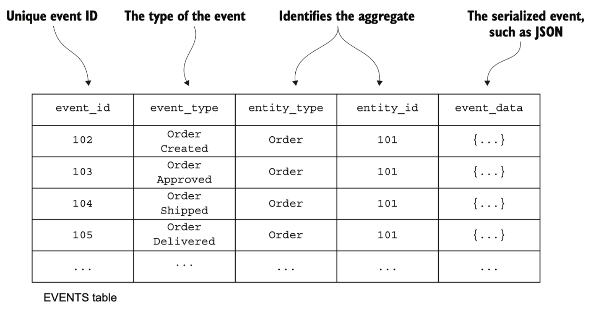

# Event Driven Architecture
**Event Driven Architecture** - это архитектура в основе которой лежит событийная модель.

- События **Outside** - это событийная модель для взаимодействия микросервисов (event collaboration)
- События **Inside** - это событийная модель внутри микросервиса или приложения (event sourcing, CQRS)
- События **Inside out** - это использование событийной модели для построения всего приложения (stream processing)

Существуют три семантических обастракции взаимодейсвтия
- Query
- Command
- Event

## События для межсервисного взаимодействия
### Events vs Commands
**Команда** – это «глагол» - требование что-то сделать от другого сервиса: AddProduct, CreateOrder
**Событие** – это «факт» - сообщение о том, что что-то произошло, и требование от другого сервиса отсутствует: ProductAdded, OrderCreated

### События и асинхронность
События являются семантически асинхронными: они сообщают о произошедшем факте и не требуют ответа.  
Поэтому проектирование архитектуры на основе событийной модели позволяет по-настоящему использовать асинхронное взаимодействие и его плюсы.
- **Надежность**: падение сервисов не влияет друг на друга, и на общую доступность
- **Масштабируемость**: можно добавлять инстансы как консьюмеров, так и продюсеров.
- **Независимость**: продюсеры ничего не знают про потребителей и можно легко добавлять новых потребителей событий не меняя их (продюсеров). 

### Event for Notification и Event for State Transfer
**События для нотификаций.** В данном случае один сервис уведомляет другой о том, что событие произошло.  
Использование событий (возможно - тут требуется уточнение: для нотификаций других сервисов)
- позволяет развязать логику (low coupling) между сервисами
- Может привести к тому, что флоу действий станет неявным. Чтобы понять, что происходит, будет очень сложно.

Антипаттерном является «пассивно-агрессивная» семантика: т.е.  когда сервис, который отправляет событие ждет, что кто-то  определенным образом его обработает.

## Паттерны проектирования событий
Под событиями обычно подразумеваются **события предметной области** - то есть факты о том, что случилось с сущностями предметной области.
Для определения событий может использоваться **Event Storming** - про это есть одельный раздел

### Проектирование событий
Status поменялся с active на blocked у пользователя.  
Какое событие отправлять?
- UserUpdated?
- UserBlocked?
- UserStatusChanged?
- Или может быть все вместе?  

Что отправлять в payload такого события?
- Только изменение?
- Полностью новое состояние?
- Только id?

На все эти вопросы нет однозначного ответа. Также как нет однозначного ответа на то, каким должен быть REST интерфейс.

### Single writer pattern
Наличие нескольких сервисов, которые отправляют одинаковый тип событий тоже не очень хорошо. Т.к. при изменении формата события, придется править одновременно два сервиса.
**Single-writer pattern** – только один сервис имеет право создавать события об определенном процессе. 

## Event sourcing
А почему бы в базе хранить не состояние объекта, а просто набор событий?
- Банковский счет – это производная от набора транзакций balance = sum(transaction.value), а не наоборот
- Любое состояние – это производная от набора фактов
- Факты или события – не меняются, а то, как мы представляем данные – меняется. На самом деле мы храним факты, а не представление.

**Что может дать Event Sourcing?**
- Аудит лог за бесплатно
- Крутые средства для дебага
- Не теряешь данных и можешь делать какие угодно проекции

**Внимание** - в Event Sourcing не может происходить изменения сущности без события.  
Отсюда следует что схема хранения выглядит следующим образом:

**Event sourcing vs Command sourcing** - Command sourcing - это плохо так как при проигрывании могут происходить некоторые события, например отсылаться емайлы и проч.

**Состояние в Event Sourcing** получается через последовательное выполнение функций над состояниями.  
Функции изменения состояния называются - **применения**

**Snapshot** - в случае когда событий много - имеет смысл делать промежуточные состояния.
**Выборки в Event Sourcing** Использовать паттерн SQRS - отделяем модель чтения от модели записи.  

Event Sourcing - паттерн уровня хранения данных. Это не архитектурный паттерн. Совершенно нормально иметь в одном микросервисе ES/CQRS, а в другом RDBMS.
