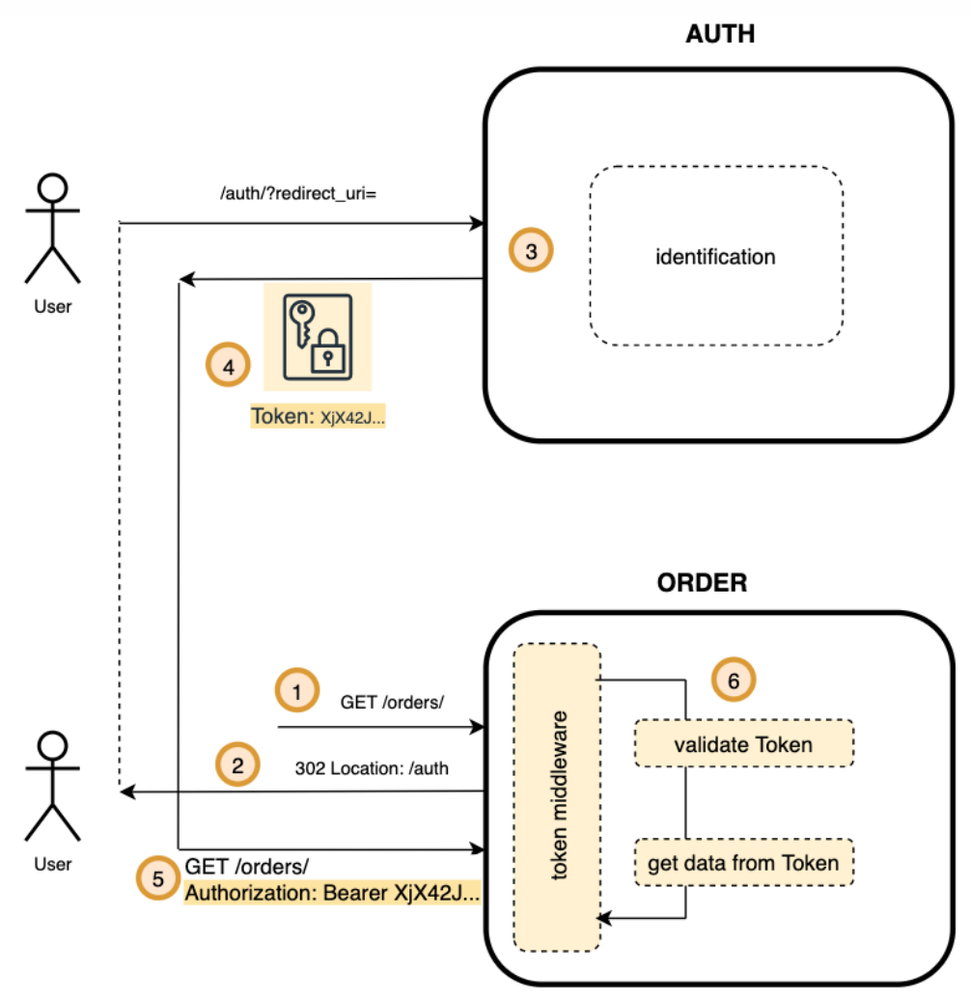

# Авторизация и аутентификация
## Определения
Есть большая путаница в терминах аутентификация, авторизация,
идентификация.
- Идентификация – это когда некий субъект идентифицировал себя
- Аутентификация – это процесс, в котором мы удостоверяемся, что
субъект действительно тот, кто он есть
- Авторизация – это процесс, когда мы уже зная, кем является субъект,
проверяем может ли он совершить действие или нет.  
  
Пример
```text
Пропускная система на режимном предприятии.
Заходит человек на КПП, охранник его спрашивает:
О: «Вы кто такой?»
Ч: «Я – Василий Пупкин» - это идентификация
О: «Покажите паспорт»
Ч: «Вот он».
Охранник сверяет имя и фамилию, и фотографию. Убеждается, что это
действительно Вася Пупкин - это аутентификация
Охранник смотрит, что Вася Пупкин есть в списках. И пропускает его –
это авторизация.
```  
В веб-сервисах, есть два типа аутентификации: при логине и сессионная
аутентификация при каждом запросе.  
В рамках нашего занятия, будем называть идентификацией – процесс
аутентификации при логине.

## OAuth2.0 и OpenID Connect
**OAuth 2.0** - это фреймворк для построения флоу, которые бы давали возможность
не только идентифицировать пользователя внешним провайдером, но давать
возможность совершать действия от лица этого пользователя с различным
ресурсами.  
Основная проблема, что OAuth2.0 не стандартизирует способ получения данных о
пользователе (Identity). Т.е. OAuth2.0 про аутентификацию и авторизацию.  
**OpenID Connect (OIDC)** решает эту проблему. Добавляется scope=openid, и в ответ
приходит ID token – это информация о пользователе специальным образом
закодированная и подписанная.

## Token-based сессии. JWT
### Token-based сессии
Чтобы из каждого микросервиса не ходить в
сервис Сессий (или в Хранилище), можно
использовать механизм сессий, основанных на
токенах.  
Сервис, который осуществляет идентификацию
отдает данные о сессии или пользователе и
подписывает эти данные свои ключом. Такие
данные назовем токеном.  
Пользователь использует этот токен для
доступа к другим сервисам.  
Сервисам при этом не надо ходить, чтобы
проверить сессию. Если токен валиден, то
сервис доверяет тем данным, которые он
получил из токена.


## Основные особенности token based cессий
- Может упростить backend разработку, если критично отсутствие единого
хранилища для сессий.
- Не обеспечивает простого решения для single sign off, поэтому если его
наличие критично, может не подойти.
- Существенно усложняет браузерную клиентскую разработку. Без специальных
сервисов или библиотек сделать безопасно token-based сессии тяжело.
  
## Service 2 Service аутентификация
### Межсервисное взаимодействие
Даже если сервисы находятся в одной доверенной сети, все-равно имеет смысл
ограничивать или как минимум отслеживать кто в какой сервис ходит.
Это бывает полезно в ситуациях
1. когда нужно переводить API на новую версию, чтобы понимать, кто еще
   пользуется старой
2. Когда виден всплеск по RPS, но не понятно, какой из сервисов его вызвал
   Контекст запроса и Identity сервиса, который вызывает API лучше передавать.

**Link:** [service to service authentication for microservice apis](https://hackernoon.com/service-to-service-authentication-for-microservice-apis-ccf4ab8073e6)

Зачастую у сервисов есть 2 типа взаимодействий:
- Обработка клиентских запросов
- Обработка сервисных запросов от доверенных сервисов внутри приложения  
  
Крайне желательно не смешивать эти два взаимодействия.
- Не стоит при запросе к другому сервису передавать клиентский токен или
симулировать клиентский запрос (с помощью подделки кук и т.д).
- Сделать отдельный префикс API для s2s endpoint-ов, например, srv/

### Аутентификация по service id
Самым простым вариантом является идентификация сервиса по Service-id.
Сервис при обращении в другой в заголовках в метаданных пересылает свой
идентификатор. Сервис, который принимает запросы у себя в конфигурации (или в
каком-то другом хранилище) проверяет это Service-id.  
Очевидный недостаток, что случайно или умышленно service-id может быть
подделан и не соответствовать действительности.

### Аутентификация по токену
Чуть посложнее вариантом является идентификация сервиса по Токену, который
нельзя легко подделать. Токен может быть как просто случайным, так и быть в
формате JWT.  
Хранение и управление токенами можно вынести в отдельный сервис. Но
зачастую такая операция не приносит существенных преимуществ, если сервисов
не очень много (>5000).

### Аутентификация в рамках сервис-меша
При наличии сервис-меша запросы идут не напрямую из сервиса в сервис, а через
прослойку проксей сервис-меша.  
За счет него можно сделать централизованное управление настройками доступа
сервисов друг к другу, и при этом инструментировать код конечных сервисов не
придется. Что является преимуществом по сравнению с предыдущими
вариантами.

## Авторизация
**Авторизация** – проверка прав. Может ли пользователь совершить то или
иное действие.

**Aрхитектурные схемы** реализации авторизации:
- Отдельный сервис для авторизации
- Проверка прав внутри сервиса  

Cхемы (методы) проверки доступа (**access control**):
- RBAC – role based access control
- ABAC – attribute based access control
- И другие: DAC, MAC, …


## Links
- [Session vs token based authentication](https://sherryhsu.medium.com/session-vs-token-based-authentication-11a6c5ac45e4)
- [Why jwts suck as session tokens](https://scotch.io/bar-talk/why-jwts-suck-as-session-tokens)
- [Spring boot authorization tutorial secure an api java](https://auth0.com/blog/spring-boot-authorization-tutorial-secure-an-api-java/)