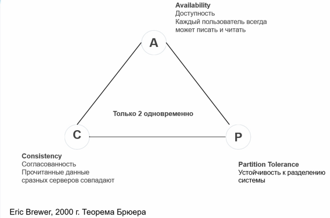

# CAP теорема

## Транзакция
Транзакция - это последовательность операций, рассматривающихся базой данных как атомарное действие и завершающаяся
либо подтверждением изменений (commit) либо откатом изменений (rollback).  

Для того чтобы транзакции можно было реализовать был придуман набора правил - ACID

## ACID
- Atomicity - Транзакция как единое целое - либо все выполняется, либо все не выполняется.
- Consistency (Correctness) - Система переходит из одного согласованного состояния - в другое согласованное состояние.
- Isolation -  Транзакции разных пользователей не должны мешать друг другую
- Durability - Результаты созраняются даже при сбое системы после завершения транзакциии.

Но их не всега возможно полностью реализовать )))

## Способы реализации ACID
1) ARIES - (Algorithms of Recovery and Isolation Exploiting Semantics) - алгоритмы восстановления систем:
   1) logging - запись в журнал всех действий транзакции, которые
      могут изменить состояние БД;
   2) checkpoints - механизм контрольных точек;
   3) поддержка покортежных (просто строка таблицы БД) блокировок;
   4) асинхронное восстановление страниц базы;
   5) поддержка разделенного запуска (сначала важная информация, потом все остальное).

2) MVCC (MultiVersion Concurrency Control) - механизм обеспечения параллельного доступа к БД:
   1) каждой сессии предоставляется «снимок» БД; 
   2) изменения в БД невидимы другим пользователям до момента фиксации транзакции;
   3) читатели не блокируют читателей;
   4) писатели не блокируют читателей;
   5) читатели не блокируют писателей

## Чем плох ACID
Ресурсоемкий и иногда слишком избыточен, особенно для распределенных систем.

## Распределенная система
Растределенной вычислительной системой можно назвать такую систему, в которой отказ компьютера, о существованиии которого 
вы даже не подозревали, может сделать ваш собственный компьютер непригодным для использования. (Лесли Лампорт)  
  
Что плохого
- Медленно - каждая транзакция применяется, только если все узлы добавили информацию о ней.
- Дорого - дата центры должны быть связанны выделенным каналом
- Избыточно - такой уровень надежности не нужен, если у вас хранятся сообщения или фотограии соц сети

## CAP теорема
### Пример распределенной системы

### Определение
- Согласованность (Consistency) – все рабочие узлы  содержат одинаковую информацию.
- Доступность (Availability) – возможность доступа к  кластеру, даже если узел в кластере выходит из строя.
- Терпимость к разделению сети (Partition Tolerance) - независимо от сбоев в работе сети узлы продолжают  работать.

Собственно сама теорема - Одновременно могут выполняться только 2 условия.

### CAP комбинации
- CA – система доступна и консистентна. Нежизнепособна в  ненадежной сети.
- CP – не будет доступна пока нет полной синхронизации между всеми узлами.
- AP – данные на разных работающих узлах могут отличаться.

### Примеры CA
- Oracle (изначально затачивалось под CA)
- MySQL (изначально затачивалось под CA)
- PG (изначально затачивалось под CA)
- SQL Server (изначально затачивалось под CA)

### Примеры CP
- Mongo
- Redis
- Clickhouse
- Elastic

### AP системы
- Hadoop
- Casandra
- CouchDB

## Минусы CAP теоремы
Теорема описывает системы слишком упрощенно.  
Каждое понятие возведено в абсолют.  
Невозможно достичь идеально CAP для всех операций, но можно выбрать, где какой параметр важнее.

# Base
- Basic Availability (базовая доступность) – каждый запрос гарантированно завершается. 
- Soft state (гибкое состояние) – состояние системы может изменяться без ввода новых данных для достижени согласования данных. 
- Eventual consistency (согласованность в конечном счете) – данные некоторое время могут быть рассогласованные, но в итоге приходят к согласованию.

# Типы баз данных

[https://db-engines.com/](https://db-engines.com/)

## Выбор DB
- Объем данных.
- Размер транзакций: длительность, количество одновременных транзакций.
- Количество одновременных соединений/сессий. 
- Соотношение операций чтения/записи.
- Масштабирование: вертикальное, горизонтальное.
- etc

